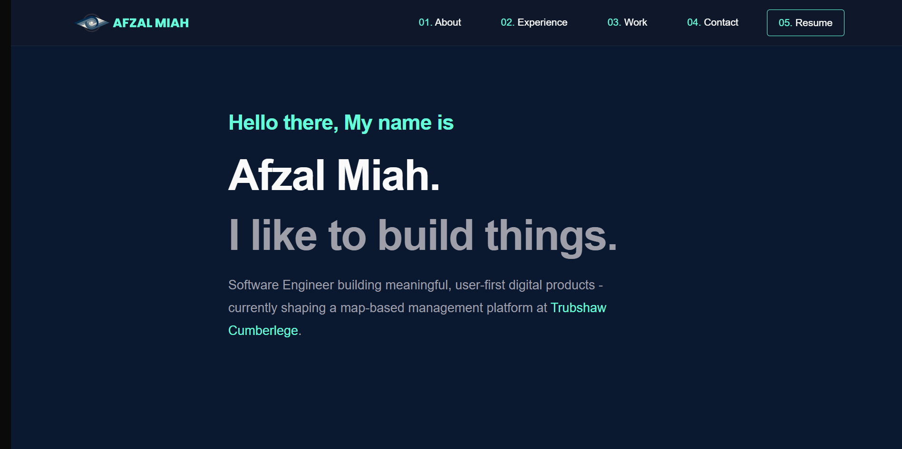

# Afzal Miah – Personal Website

This is the source code for my personal website, built with **Next.js**, **Tailwind CSS**, and **Framer Motion**. It highlights my experience, contact information and some projects.



---

## 🚀 Features

- **Next.js**
- **Tailwind CSS**
- **Framer Motion**
- **Responsive Design**.
- **Embla Carousel**

---

## 📦 Tech Stack

- **Frontend:** React, Next.js, Tailwind CSS, Framer Motion
- **Carousel:** Embla Carousel
- **Deployment:** Vercel (auto-deploy previews for PRs)
- **Backend:** Next.js API route for handling requests

---

## ⚡ Getting Started

### 1. Clone the repository

```bash
git clone https://github.com/affyzal/nextjs-app.git
cd nextjs-app
```

### 2. Install dependencies

```
npm install
# or
yarn install
```

### 3. Run development server

```
npm run dev
# or
yarn dev
```

Open [http://localhost:3000]() in your browser.

### 4. Build for production

```
npm run build
npm start
```

or 

```
yarn build
yarn start
```

The production site will run at [http://localhost:3000]()..

# 🧹 Code Quality

ESLint + Prettier integrated for consistent formatting.

GitHub Actions workflow runs linting on pull requests.

# 📂 Project Structure

```
├─ src/
│ ├─ app/
│ │ ├─ page.tsx # Main landing page
│ │ ├─ sections/ # Scrollable sections for the main page
│ │ │ ├─ About.tsx
│ │ │ ├─ Experience.tsx
│ │ │ ├─ Work.tsx
│ │ │ └─ Contact.tsx
│ ├─ components/ # Reusable components (carousel, buttons, header, etc.)
│ └─ styles/ # Tailwind configuration and global styles
├─ public/ # Static assets (images, icons)
├─ package.json
└─ next.config.js
```

# 📬 Contact

Email: affyzal@gmail.com

GitHub: https://github.com/affyzal

LinkedIn: https://www.linkedin.com/in/afzalmiah/

# 🔗 Deployment

This site is deployed on Vercel. Preview builds are automatically generated for pull requests, and production deploys trigger on merges to the main branch.

Production: https://www.afzalmiah.dev

Preview: Auto-generated per PR for testing

# ❤️ Acknowledgements

Next.js

Tailwind CSS

Framer Motion

Embla Carousel
